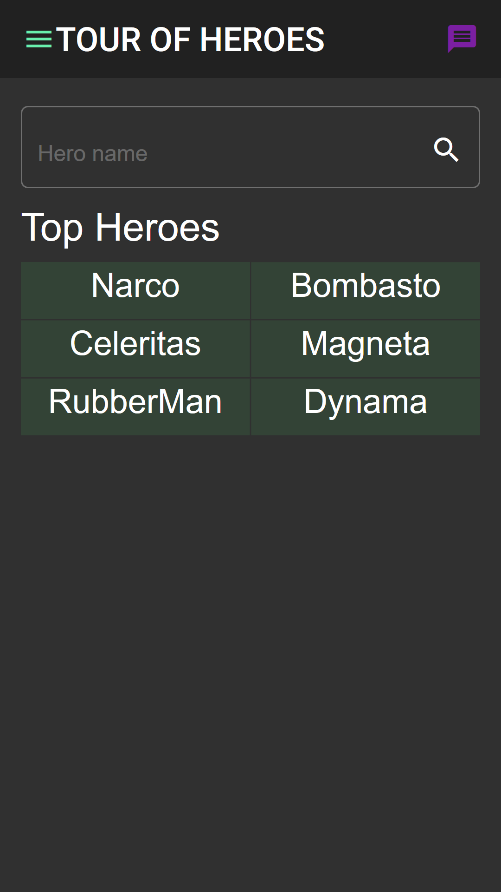
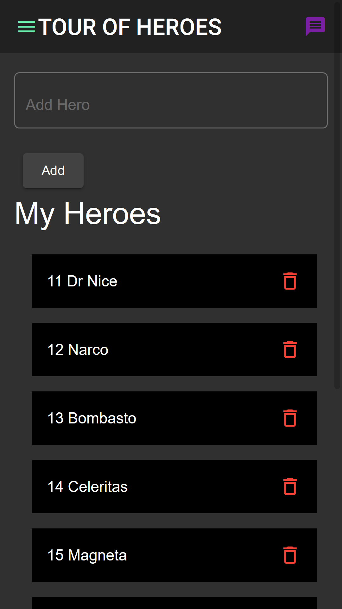
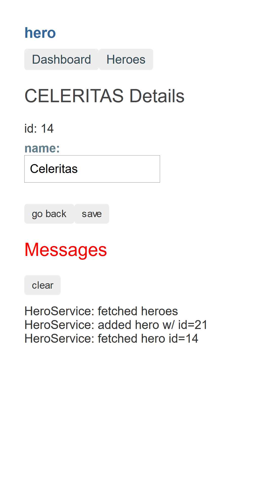
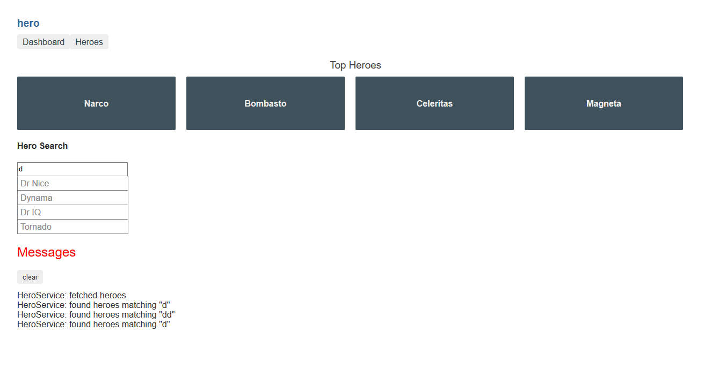
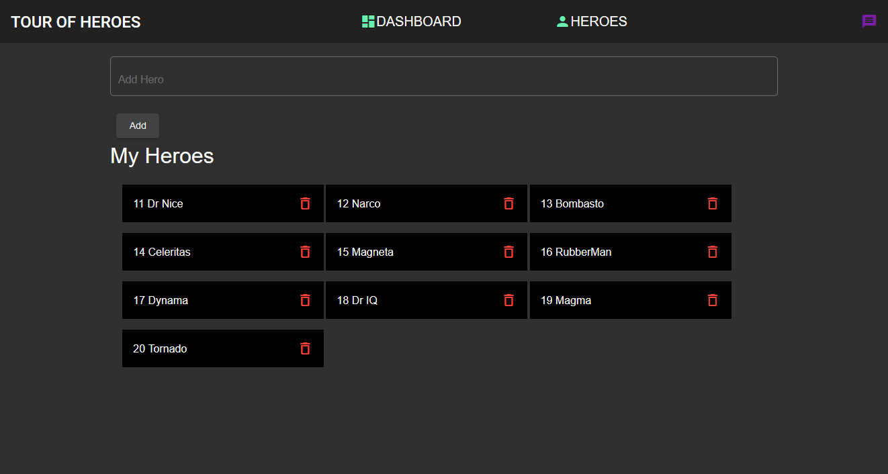
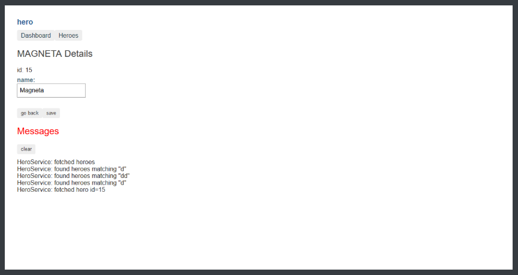

# Tour of Hero app the angular official tutorial for angular 8.3.12:

### Required Environment:

1. Windows/ Linux/ Mac system
2. NodeJs installed 10 or higher
3. Install angular/cli using $ npm install -g @angular/cli@latest

### Clone the app & run in the dev server:

$ git clone https://github.com/hash-lab/hero.git

$ cd hero

$ npm install 

$ ng serve

### App of Tour of the Heroes:

> This application shows the basics of every aspects of angular 8.
>
> The App has three route paths i.e: /dashboard , /heroes, and /detail/:id 
>
> The App uses mock database HttpClientInMemoryWebApiModule a package, that
>
> simulates  database operations like GET, PUT, DELETE, POST

### Some screenshots from the app:

### MOBILE VIEW:

	
	
	

### DESKTOP VIEW:

> Hero Dashboard on Desktop

> Hero List on Desktop

> Hero Detail on Desktop

#### Future development idea:

> Complete turnover of the app using Angular Material and Google Material Icons. Look for the other branch.
>
> hero/${branch -- material-hero }
>
> Coming Soon.
