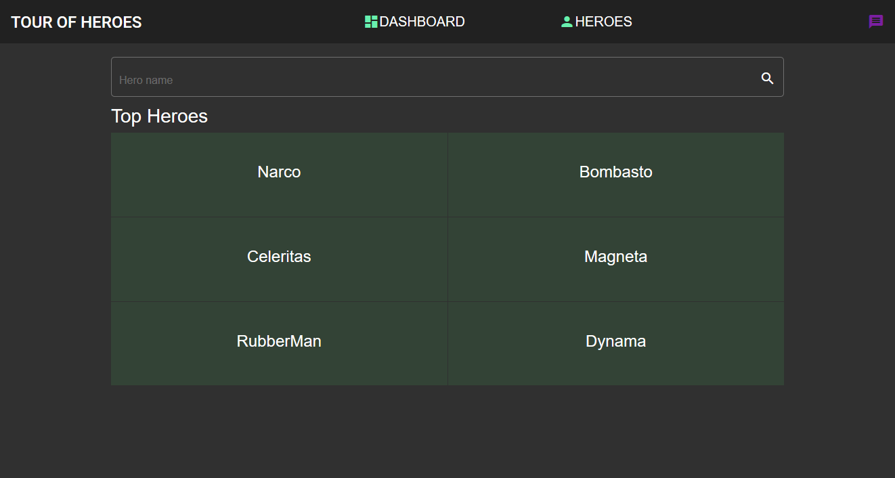

# Tour of Hero app with Angular Material Design:

### Required Environment:

1. Windows/ Linux/ Mac system
2. NodeJs installed 10 or higher
3. Install angular/cli using $ npm install -g @angular/cli@latest

### Clone the app & run in the dev server:

$ git clone https://github.com/hash-lab/hero.git

$ cd hero

$ npm install 

$ ng serve

### App of Tour of the Heroes:

> This application shows the basics of every aspects of angular 8.
>
> The App has three route paths i.e: /dashboard , /heroes, and /detail/:id 
>
> The App uses mock database HttpClientInMemoryWebApiModule a package, that
>
> simulates  database operations like GET, PUT, DELETE, POST

### Material Design Added:

> It's an awesome way to make your website beautiful without getting your hand dirty with 
>
> css and javascript heap. This app uses a dark theme Purple-Grey from material pre-built 
>
> themes.

### Some screenshots from the app:

### MOBILE VIEW:
___

#### (From left to right) : Sidenav - Dashboard - Message Box

#### (From left to right) : Heroes List - Seach Box - Hero Detail 

### DESKTOP VIEW:
___

#### Desktop Dashboard

#### Desktop Hero List

#### Desktop Hero Detail

#### Desktop Search Box

#### Desktop Message Box

* This app is soon to be published in firebase free-tier 
* link coming soon.*
